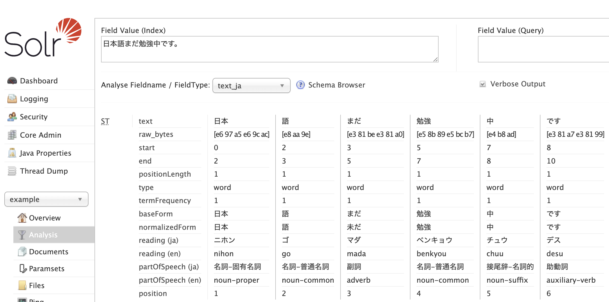
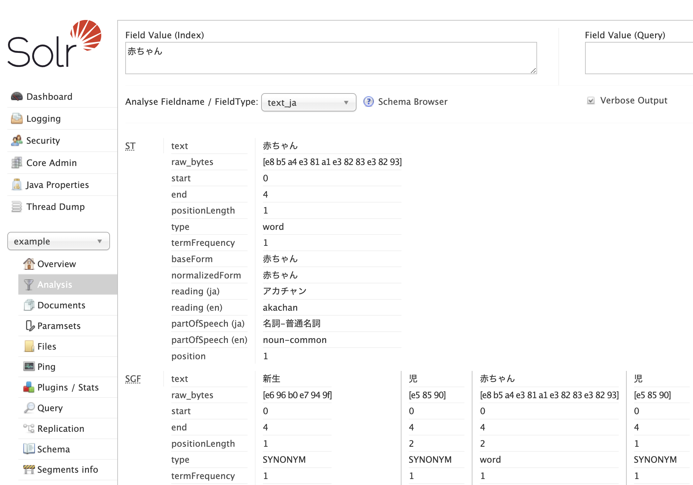

<picture>
  <a href="https://lucene.apache.org/"></a>
</picture>

# Solr Lucene Analyzer Sudachi

<picture>
  <a href="https://github.com/WorksApplications/Sudachi"></a>
</picture>

[Sudachi](https://github.com/WorksApplications/Sudachi) を活用してる日本語の形態素解析 Lucene プラグイン

A Lucene plugin based on [Sudachi](https://github.com/WorksApplications/Sudachi) tokenizer for the Japanese morphological analysis


### Table of Contents
* [Solr Lucene Analyzer Sudachi plugin philosophy](#solr-lucene-analyzer-sudachi-plugin-philosophy)
* [Plugin compatibility with Lucene and Solr](#plugin-compatibility-with-lucene-and-solr)
    * [Solr field analysis screen](#solr-field-analysis-screen)
    * [Solr field with synonyms analysis screen](#solr-field-with-synonyms-analysis-screen)
* [Plugin installation and configuration](#plugin-installation-and-configuration)
    * [Configuring the dictionaries and building a plugin uber jar](#configuring-the-dictionaries-and-building-the-plugin-jar)
    * [Solr schema configuration](#solr-schema-configuration)
* [Local Development](#local-development)
    * [Prerequisites](#prerequisites)
        * [Downloading a Sudachi dictionary](#downloading-a-sudachi-dictionary)
        * [Changing local Sudachi dictionary location for runtime](#changing-local-sudachi-dictionary-location-for-runtime)
    * [System Requirements](#system-requirements)
    * [Build System](#build-system)
        * [List of Gradle tasks](#list-of-gradle-tasks)
        * [Building](#building)
        * [Formatting](#formatting)
    * [Testing](#testing)
        * [Unit tests](#unit-tests)
        * [Integration tests](#integration-tests)
        * [Functional tests](#functional-tests)
        * [End-to-End tests](#end-to-end-tests)
        * [Smoke tests](#smoke-tests)
* [Appendix - Lucene Japanese morphological analysis landscape](#appendix---lucene-japanese-morphological-analysis-landscape)
    * [Lucene Kuromoji morphological analyzer](#lucene-kuromoji-morphological-analyzer)  
    * [What is MeCab](#what-is-mecab)
    * [How MeCab-based tokenizers work](#how-mecab-based-tokenizers-work)
    * [What is IPA dictionary](#what-is-ipa-dictionary)
    * [What is UniDic dictionary](#what-is-unidic-dictionary)
    * [Why the built-in Lucene Kuromoji module may impact Japanese search accuracy](#why-the-built-in-lucene-kuromoji-module-may-impact-japanese-search-accuracy)
    * [Conclusion](#conclusion) 
* [Licenses](#licenses)
    * [Sudachi and Sudachi Logo](#sudachi-and-sudachi-logo)
    * [Lucene and Lucene Logo](#lucene-and-lucene-logo)
    * [Current work](#current-work)
<!-- TOC -->

## Solr Lucene Analyzer Sudachi plugin philosophy

The plugin strives to where possible:

- Leverage as much as possible the other good work by the [Sudachi](https://github.com/WorksApplications/Sudachi) owners, in particular the [elasticsearch-sudachi](https://github.com/WorksApplications/elasticsearch-sudachi) plugin.
- Minimize as much as possible the amount of configuration that the user has to do when configuring the plugin in Solr. For example, the Sudachi dictionary will be downloaded behind the scenes and unpacked in the right location for the consumption by the plugin at runtime.

[`Back to top`](#table-of-contents)

## Plugin compatibility with Lucene and Solr

Since the plugin is tightly coupled with Lucene, being compatible with a given version of Lucene makes the plugin compatible with the same version of Solr, at least until the Solr version `v9.0.0` (incl.)  From Solr version `v9.1.0` (incl.), Solr and Lucene versions started to diverge.

There are a number of [Solr version matching available repository tags](https://github.com/azagniotov/solr-lucene-analyzer-sudachi/tags) which you can git clone before building the plugin jar.

### Solr field analysis screen

Solr field analysis screen demonstrating tokenized terms and their respective metadata, similar to Lucene Kuromoji behavior: 



[`Back to top`](#table-of-contents)

### Solr field with synonyms analysis screen

The configured synonyms are `赤ちゃん,新生児,児`. The `SynonymGraphFilterFactory` was leveraging a tokenizer, therefore the synonym `新生児` got tokenized to `新生` and `児`:   



[`Back to top`](#table-of-contents)

## Plugin installation and configuration

Whether you are running Solr in Docker environment or on a bare metal machine, the installation and configuration are the same. The steps that need to happen are pretty much those that are taken in the Dockerfiles under the [src/smokeTest](src/smokeTest). Run the following commands:

### Configuring the dictionaries and building the plugin jar

1. Clone one of the [Solr version matching available repository tags](https://github.com/azagniotov/solr-lucene-analyzer-sudachi/tags), e.g.:

   `git clone -b v9.4.0 https://github.com/azagniotov/solr-lucene-analyzer-sudachi.git --depth 1`

2. Change to the cloned directory

   `cd solr-lucene-analyzer-sudachi`

3. Download and configure dictionaries locally (see [Downloading a Sudachi dictionary](#downloading-a-sudachi-dictionary) for more information about the behavior of this command)

   `./gradlew configureDictionariesLocally`

4. Assemble the plugin uber jar

   `./gradlew -PsolrVersion=9.4.0 assemble`

5. Copy the built plugin jar to the Solr home lib directory

   `cp ./build/libs/solr-lucene-analyzer-sudachi*.jar /opt/solr/lib`

6. [**When installing on bare metal machines**] Sanity check Unix file permissions

   Check the directory permissions to make sure that Solr can read the files under `/tmp/sudachi/`

7. [Optional] You can change the default location of Sudachi dictionary in the file system from `/tmp/sudachi/` to somewhere else. As an example, check the section [Changing local Sudachi dictionary location for runtime](#changing-local-sudachi-dictionary-location-for-runtime) and/or the [src/smokeTest/solr_9.x.x/solr_9_4_0/Dockerfile.arm64#L52-L62](https://github.com/azagniotov/solr-lucene-analyzer-sudachi/blob/master/src/smokeTest/solr_9.x.x/solr_9_4_0/Dockerfile.arm64#L52-L62)


[`Back to top`](#table-of-contents)

### Solr schema configuration

The current section provides a few `schema.xml` (or a `managed-schema` file) configuration examples for the `text_ja` field:

Simple example of `<analyzer>` XML element
<details markdown=block>
  <summary markdown=span>
   <code>
     Click to expand
   </code>

  </summary>

  ```xml
  <fieldType name="text_ja" class="solr.TextField" autoGeneratePhraseQueries="false" positionIncrementGap="100">
    <analyzer>
      <tokenizer class="io.github.azagniotov.lucene.analysis.ja.sudachi.tokenizer.SudachiTokenizerFactory" mode="search" discardPunctuation="true" />
      <filter class="io.github.azagniotov.lucene.analysis.ja.sudachi.filters.SudachiBaseFormFilterFactory" />
      <filter class="io.github.azagniotov.lucene.analysis.ja.sudachi.filters.SudachiPartOfSpeechStopFilterFactory" tags="lang/stoptags_ja.txt" />
      <filter class="solr.CJKWidthFilterFactory" />

      <!-- Removes common tokens typically not useful for search, but have a negative effect on ranking -->
      <filter class="solr.StopFilterFactory" ignoreCase="true" words="lang/stopwords_ja.txt" />

      <!-- Normalizes common katakana spelling variations by removing any last long sound character (U+30FC) -->
      <filter class="io.github.azagniotov.lucene.analysis.ja.sudachi.filters.SudachiKatakanaStemFilterFactory" minimumLength="4" />

      <!-- Sutegana (捨て仮名) are small letters of Hiragana and Katakana syllabaries. In the old / archaic Japanese texts, Sutegana (捨て仮名) is not used unlike in the modern texts. -->
      <filter class="io.github.azagniotov.lucene.analysis.ja.sudachi.filters.SudachiJapaneseHiraganaUppercaseFilterFactory" />
      <filter class="io.github.azagniotov.lucene.analysis.ja.sudachi.filters.SudachiJapaneseKatakanaUppercaseFilterFactory" />

      <!-- Lower-cases romaji characters -->
      <filter class="solr.LowerCaseFilterFactory" />
    </analyzer>
  </fieldType>
  ```

</details>

A more comprehensive example of two `<analyzer>` XML elements, query time and indexing time analyzers with synonym support. For synonym support, Lucene's `SynonymGraphFilterFactory` and `FlattenGraphFilterFactory` are configured.

<details markdown=block>
  <summary markdown=span>
   <code>
     Click to expand
   </code>
  </summary>

  ```xml
  <fieldType name="text_ja" class="solr.TextField" autoGeneratePhraseQueries="false" positionIncrementGap="100">
    <analyzer type="query">
        <tokenizer class="io.github.azagniotov.lucene.analysis.ja.sudachi.tokenizer.SudachiTokenizerFactory" mode="search" discardPunctuation="true" />
        <!--
          If you use SynonymGraphFilterFactory during indexing, you must follow it with FlattenGraphFilter
          to squash tokens on top of one another like SynonymFilter, because the indexer can't directly
          consume a graph.

          FlattenGraphFilterFactory converts an incoming graph token stream, such as one from SynonymGraphFilter,
          into a flat form so that all nodes form a single linear chain with no side paths. Every path through the
          graph touches every node. This is necessary when indexing a graph token stream, because the index does
          not save PositionLengthAttribute and so it cannot preserve the graph structure. However, at search time,
          query parsers can correctly handle the graph and this token filter should NOT be used.
        -->
        <filter class="solr.SynonymGraphFilterFactory"
                synonyms="synonyms_ja.txt"
                ignoreCase="true"
                expand="true"
                format="solr"
                tokenizerFactory.mode="search"
                tokenizerFactory.discardPunctuation="true"
                tokenizerFactory="io.github.azagniotov.lucene.analysis.ja.sudachi.tokenizer.SudachiTokenizerFactory" />
        <filter class="io.github.azagniotov.lucene.analysis.ja.sudachi.filters.SudachiBaseFormFilterFactory" />
        <filter class="io.github.azagniotov.lucene.analysis.ja.sudachi.filters.SudachiPartOfSpeechStopFilterFactory" tags="lang/stoptags_ja.txt" />
        <filter class="solr.CJKWidthFilterFactory" />

        <!-- Removes common tokens typically not useful for search, but have a negative effect on ranking -->
        <filter class="solr.StopFilterFactory" ignoreCase="true" words="lang/stopwords_ja.txt" />

        <!-- Normalizes common katakana spelling variations by removing any last long sound character (U+30FC) -->
        <filter class="io.github.azagniotov.lucene.analysis.ja.sudachi.filters.SudachiKatakanaStemFilterFactory" minimumLength="4" />

		<!-- Sutegana (捨て仮名) are small letters of Hiragana and Katakana syllabaries. In the old / archaic Japanese texts, Sutegana (捨て仮名) is not used unlike in the modern texts. -->
		<filter class="io.github.azagniotov.lucene.analysis.ja.sudachi.filters.SudachiJapaneseHiraganaUppercaseFilterFactory" />
		<filter class="io.github.azagniotov.lucene.analysis.ja.sudachi.filters.SudachiJapaneseKatakanaUppercaseFilterFactory" />

        <!-- Lower-cases romaji characters -->
        <filter class="solr.LowerCaseFilterFactory" />
    </analyzer>

    <analyzer type="index">
        <tokenizer class="io.github.azagniotov.lucene.analysis.ja.sudachi.tokenizer.SudachiTokenizerFactory" mode="search" discardPunctuation="true" />
        <!--
          If you use SynonymGraphFilterFactory during indexing, you must follow it with FlattenGraphFilter
          to squash tokens on top of one another like SynonymFilter, because the indexer can't directly
          consume a graph.

          FlattenGraphFilterFactory converts an incoming graph token stream, such as one from SynonymGraphFilter,
          into a flat form so that all nodes form a single linear chain with no side paths. Every path through the
          graph touches every node. This is necessary when indexing a graph token stream, because the index does
          not save PositionLengthAttribute and so it cannot preserve the graph structure. However, at search time,
          query parsers can correctly handle the graph and this token filter should NOT be used.

          From: org.apache.lucene.analysis.core.FlattenGraphFilterFactory
        -->
        <filter class="solr.SynonymGraphFilterFactory"
                synonyms="synonyms_ja.txt"
                ignoreCase="true"
                expand="true"
                format="solr"
                tokenizerFactory.mode="search"
                tokenizerFactory.discardPunctuation="true"
                tokenizerFactory="io.github.azagniotov.lucene.analysis.ja.sudachi.tokenizer.SudachiTokenizerFactory" />
        <filter class="solr.FlattenGraphFilterFactory" />
        <filter class="io.github.azagniotov.lucene.analysis.ja.sudachi.filters.SudachiBaseFormFilterFactory" />
        <filter class="io.github.azagniotov.lucene.analysis.ja.sudachi.filters.SudachiPartOfSpeechStopFilterFactory" tags="lang/stoptags_ja.txt" />
        <filter class="solr.CJKWidthFilterFactory" />

        <!-- Removes common tokens typically not useful for search, but have a negative effect on ranking -->
        <filter class="solr.StopFilterFactory" ignoreCase="true" words="lang/stopwords_ja.txt" />

        <!-- Normalizes common katakana spelling variations by removing any last long sound character (U+30FC) -->
        <filter class="io.github.azagniotov.lucene.analysis.ja.sudachi.filters.SudachiKatakanaStemFilterFactory" minimumLength="4" />

		<!-- Sutegana (捨て仮名) are small letters of Hiragana and Katakana syllabaries. In the old / archaic Japanese texts, Sutegana (捨て仮名) is not used unlike in the modern texts. -->
		<filter class="io.github.azagniotov.lucene.analysis.ja.sudachi.filters.SudachiJapaneseHiraganaUppercaseFilterFactory" />
		<filter class="io.github.azagniotov.lucene.analysis.ja.sudachi.filters.SudachiJapaneseKatakanaUppercaseFilterFactory" />

        <!-- Lower-cases romaji characters -->
        <filter class="solr.LowerCaseFilterFactory" />
    </analyzer>
  </fieldType>
  ```

</details>

[`Back to top`](#table-of-contents)


## Local Development

### Prerequisites

#### Downloading a Sudachi dictionary

The plugin needs a dictionary in order to run the tests. Thus, it needs to be downloaded using the following command:

```bash
./gradlew configureDictionariesLocally
```

The above command does the following:
1. Downloads a system dictionary `sudachi-dictionary-<YYYYMMDD>-full.zip` (The `YYYYMMDD` is defined in [gradle.properties#sudachiDictionaryVersion](gradle.properties)) ZIP from AWS and unpacks it under the `<PROJECT_ROOT>/.sudachi/downloaded/` (if the ZIP has been downloaded earlier, the downloaded file will be reused)
2. Unzips the content under the `/tmp/sudachi/system-dict/`
3. Renames the downloaded `system_full.dic` to `system.dict`
4. Copies the [user-dictionary/user_lexicon.csv](user-dictionary/user_lexicon.csv) under the `/tmp/sudachi/`. The CSV is used to create a User dictionary. Although user defined dictionary contains only two entries, this sets an example how to add user dictionary metadata entries.
5. Builds a Sudachi user dictionary `user_lexicon.dict` from the CSV and places it under the `/tmp/sudachi/system-dict`

#### Changing local Sudachi dictionary location for runtime

At runtime, the plugin expects the system and user dictionaries to be located at `/tmp/sudachi/system-dict/system.dict` and `/tmp/sudachi/user_lexicon.dict` respectively.

But, their location in the local file system (e.g.: in a Docker container or your local laptop) can be controlled via the ENV variables `SUDACHI_SYSTEM_DICT` and `SUDACHI_USER_DICT` respectively.

[`Back to top`](#table-of-contents)

### System Requirements

- The plugin keeps Java 8 source compatibility at the moment
- At least JDK 8

### Build System

The plugin uses [Gradle](https://gradle.org/) for as a build system.

#### List of Gradle tasks

For list of all the available Gradle tasks, run the following command:

```bash
./gradlew tasks
```

#### Building

Building and packaging can be done with the following command:

```bash
./gradlew build
```

#### Formatting

The project leverages the [Spotless Gradle plugin](https://github.com/diffplug/spotless/tree/main/plugin-gradle) and follows the [palantir-java-format](https://github.com/palantir/palantir-java-format) style guide.

To format the sources, run the following command:

```bash
./gradlew spotlessApply
```

To note: Spotless Gradle plugin is invoked implicitly when running the `./gradlew build` command.

### Testing

#### Unit tests

To run unit tests, run the following command:

```bash
./gradlew test
```

#### Integration tests

The meaning of `integration` is that the test sources extend from Lucene's `BaseTokenStreamTestCase` in order to spin-up the Lucene ecosystem.

To run integration tests, run the following command:

```bash
./gradlew integrationTest
```

#### Functional tests

The meaning of `functional` is that the test sources extend from Lucene's `BaseTokenStreamTestCase` in order to spin-up the Lucene ecosystem and create a searchable document index in the local filesystem for the purpose of the tests.

To run functional tests, run the following command:

```bash
./gradlew functionalTest
```

#### End-to-End tests

The meaning of `End-to-End` is that the test sources extend from Solr's `SolrTestCaseJ4` in order to spin-up a Solr ecosystem using an embedded Solr server instance and create a searchable document index in the local filesystem for the purpose of the tests.

To run end-to-end tests, run the following command:

```bash
./gradlew endToEndTest
```

#### Smoke tests

Smoke tests utilize Docker Solr images to deploy the built plugin jar into Solr app. These tests are not automated (i.e.: they do not run on Ci) and should be executed manually. You can find the Dockerfiles under the [src/smokeTest](src/smokeTest)

[`Back to top`](#table-of-contents)

## Appendix - Lucene Japanese morphological analysis landscape

Tokenization, or morphological analysis, is a fundamental and important technology for processing a Japanese text, especially for industrial applications. Unlike whitespace separation between words for English text, Japanese text does not contain explicit word boundary information. The methods to recognize words within a text are unobvious and the morphological analysis of a token (segmentation + part-of-speech tagging) in Japanese is not trivial. Over time, there were various morphological tools developed, each with different kinds of the standard.

[`Back to top`](#table-of-contents)

### Lucene Kuromoji morphological analyzer

The Lucene "Kuromoji" is a built-in MeCab-style Japanese morphological analysis component that provides analysis/tokenization capabilities. By default, Kuromoji leverages [under the hood](https://github.com/apache/lucene/blob/2a3e5ca07f5df1f5080b5cb54ff104b7924e99f3/gradle/generation/kuromoji.gradle#L50-L97) the [MeCab tokenizer’s “IPA” dictionary (ja)](https://taku910.github.io/mecab/).

Kuromoji analyzer has its roots in the Kuromoji analyzer made by [Atilika](https://www.atilika.org/), a small NLP company in Tokyo. Atilika has donated Kuromoji codebase (see [LUCENE-3305](https://issues.apache.org/jira/browse/LUCENE-3305)) to the Apache Software Foundation as of Apache Lucene and Apache Solr v3.6. These days, the implementations of Atilika and Lucene Kuromoji have diverged, while [Atilika Kuromoji](https://github.com/atilika/kuromoji) seems to be abandoned anyways.

[`Back to top`](#table-of-contents)

### What is MeCab

[MeCab (ja)](https://taku910.github.io/mecab/) is an open source morphological analysis engine developed through a joint research unit project between Kyoto University Graduate School of Informatics and Nippon Telegraph and Telephone Corporation's Communication Science Research Institute. 

MeCab was created by [Taku Kudo](http://chasen.org/~taku/) in ~2007. He/they made a breakthrough by leveraging the [CRF algorithm](https://en.wikipedia.org/wiki/Conditional_random_field) (Conditional Random Fields) to train a CRF model and build a word dictionary by [utilizing the trained model](https://taku910.github.io/mecab/).

[`Back to top`](#table-of-contents)

### How MeCab-based tokenizers work

MeCab-style tokenizer builds a graph-like structure (i.e.: lattice) to represent input corpus (i.e.: text terms/words) and to find the best connected path through that graph by leveraging Viterbi algorithm. 

For Lattice-based tokenizers, a dictionary is an object or a data structure that provides a list of known terms or words, as well as how those terms should appear next to each other (i.e.: connection cost) according to Japanese grammar or some statistical probability. During the tokenization process, a tokenizer uses the dictionary in order to tokenize the input text by leveraging the dictionary metadata. The objective of tokenizer is to find the best tokenization that maximizes the sum of phrase scores.

To expand on the dictionary: a dictionary is not a mere "word collection", it includes a machine-learned language model which is carefully trained (for example, with the help of [MeCab CLI (ja)](https://taku910.github.io/mecab/learn.html)). If you want to update the dictionary, you have to start from "re-training" the model on a larger / fresher lexicon.

[`Back to top`](#table-of-contents)

### What is IPA dictionary

The IPA dictionary is the MeCab's so-called "standard dictionary", characterized by a more intuitive separation of morphological units than UniDic. In contrast, UniDic splits a sentence into smaller example units for retrieval. UniDIC is a dictionary based on "[short units](https://clrd.ninjal.ac.jp/bccwj/en/morphology.html)" (短単位 read as "tantani") as defined by the NINJAL (National Institute for Japanese Language and Linguistics) which produces and maintains the UniDic dictionary.

From a Japanese full-text search perspective, consistency of the tokenization (regardless of the length of the text) is more important. If you are interested in this topic, please check this research paper. "[情報検索のための単語分割一貫性の定量的評価: Quantitative Evaluation of Toekinization Consistency for Information Retrieval in Japanese](https://www.anlp.jp/proceedings/annual_meeting/2016/pdf_dir/D6-5.pdf)".  Therefore, UniDic dictionary is more suitable for Japanese full-text information retrieval since the dictionary is well maintained by researchers of NINJAL (to the best of my knowledge) and its shorter lexical units make it more suitable for splitting words when searching (tokenization is more coarse-grained) than the IPA dictionary. 

[`Back to top`](#table-of-contents)

### What is UniDic dictionary

UniDic dictionaries produced by NLP researchers at NINJAL (National Institute for Japanese Language and Linguistics), which are based on the BCCWJ corpus and leverage MeCab-style dictionary format.

The “The Balanced Corpus of Contemporary Written Japanese” (BCCWJ) is a corpus created for the purpose of attempting to grasp the breadth of contemporary written Japanese, containing extensive samples of modern Japanese texts in order to create as uniquely balanced a corpus as possible. 

The data is ~104.3 million words, covering genres such as general books and magazines, newspapers, business reports, blogs, internet forums, textbooks, and legal documents among others. Random samples of each genre were taken in order to be morphologically analyzed for the purpose of creating a dictionary. 

Thus, UniDic is a lexicon (i.e.: collection of morphemes) of BCCWJ core data (about couple percents of the whole corpus is manually annotated with things like part of speech, etc). The approximate UniDic size is ~20-30k sentences.

As a supplementary fun read, you can have a look at the excellent article that outlines [Differences between IPADic and UniDic](https://github.com/ikawaha/kagome/wiki/About-the-dictionary#differences-between-ipadic-and-unidic) by the author of the GoLang-based [Kagome](https://github.com/ikawaha/kagome) tokenizer (**TL;DR**: UniDic has more advantage for lexical searching purpose).

Thus, the above makes a UniDic (which is the dictionary that Sudachi tokenizer leverages) dictionary to be the best choice for a MeCab-based tokenizer dictionary.

[`Back to top`](#table-of-contents)

### Why the built-in Lucene Kuromoji module may impact Japanese search accuracy

The MeCab IPA dictionary ([bundled within Lucene Kuromoji](https://github.com/apache/lucene/blob/2a3e5ca07f5df1f5080b5cb54ff104b7924e99f3/gradle/generation/kuromoji.gradle#L57-L60) by default) dates back to 2007. This means that there is a _high likelihood_ that some newer words / proper nouns that came into the use after 2007 (e.g: new Japanese imperial era `令和` (read as "Reiwa"), people's names, manga/anime/brand/place names, etc) _may not_ be tokenized correctly. The "not correctly" here means under-tokenized or over-tokenized. 

Although the [support for the current Japanese imperial era "Reiwa" (令和) has been added to the Lucene Kuromoji especially by Uchida Tomoko](https://github.com/apache/lucene/commit/7619c07d3a80bb781f688c2cbbff33024142670a), for many post-2007 (i.e.: more modern) words there is no explicit support by the Lucene Kuromoji maintainers. 

[`Back to top`](#table-of-contents)

### Conclusion

The adoption of a more updated version of the dictionary can directly influence the search quality and accuracy of the 1st-phase retrieval, the Solr output. Depending on the business domain of a company that leverages search as its core function, this may create more or less issues.

Therefore, **Solr Lucene Analyzer Sudachi** is a reasonable choice for those who are interested to run their Solr eco-system on a more up-to date Japanese morphological analysis tooling. 

[`Back to top`](#table-of-contents)

## Licenses

### Sudachi and Sudachi Logo

Sudachi by Works Applications Co., Ltd. is licensed under the [Apache License, Version2.0](http://www.apache.org/licenses/LICENSE-2.0.html). See [https://github.com/WorksApplications/Sudachi#licenses](https://github.com/WorksApplications/Sudachi#licenses)

Sudachi logo by Works Applications Co., Ltd. is licensed under the [Apache License, Version2.0](http://www.apache.org/licenses/LICENSE-2.0.html). See [https://github.com/WorksApplications/Sudachi#logo](https://github.com/WorksApplications/Sudachi#logo)

### Lucene and Lucene Logo

Lucene, a high-performance, full-featured text search engine library written in Java and its logo are licensed under the [Apache License, Version2.0](http://www.apache.org/licenses/LICENSE-2.0.html). See [https://lucene.apache.org/core/documentation.html](https://lucene.apache.org/core/documentation.html)


### Current work

The Lucene-based Solr plugin leveraging [Sudachi](https://github.com/WorksApplications/Sudachi) by Alexander Zagniotov is licensed under the [Apache License, Version2.0](http://www.apache.org/licenses/LICENSE-2.0.html)

```
Copyright (c) 2023-2024 Alexander Zagniotov

Licensed under the Apache License, Version 2.0 (the "License");
you may not use this file except in compliance with the License.
You may obtain a copy of the License at

       http://www.apache.org/licenses/LICENSE-2.0

Unless required by applicable law or agreed to in writing, software
distributed under the License is distributed on an "AS IS" BASIS,
WITHOUT WARRANTIES OR CONDITIONS OF ANY KIND, either express or implied.
See the License for the specific language governing permissions and
limitations under the License.
```
[`Back to top`](#table-of-contents)
